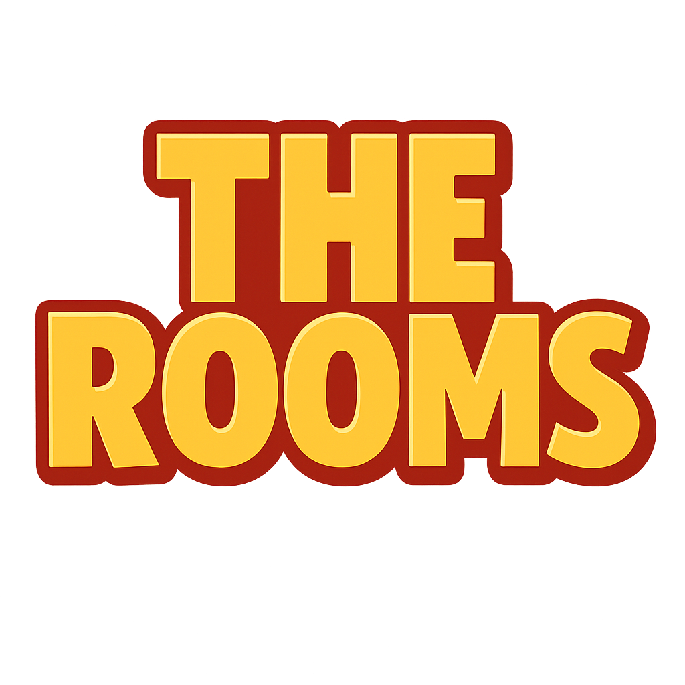

  

# TheRooms

Welcome to **TheRooms** - a social metaverse building game inspired by Habbo Hotel, built with cutting-edge web technologies.

## 🎮 What is TheRooms?

TheRooms is a browser-based 3D social space where players can:
- Explore and build in customizable rooms
- Interact with other players in real-time
- Place and arrange furniture
- Customize their character from 45+ models
- Socialize and chat with the community

Think Habbo Hotel meets modern web3 gaming - accessible directly in your browser with no downloads required.

  
  
<em>Explore unique room layouts with your customized character</em>

## 🚀 Current State

We're in **active development** and building this project live! Here's what's working now:

### ✅ Implemented Features
- **8 Unique Room Types**: Small, Medium, Large, Studio, L-Shape, Penthouse, Loft, and Suite - each with unique layouts (L-shapes, T-shapes, Plus configurations)
- **Character System**: 45+ character models with smooth animations (idle, walk)
- **Physics-Based Movement**: Realistic collision detection and player movement using Rapier physics
- **Furniture Placement**: Grid-based system for placing and arranging furniture items
- **Isometric Camera**: Smooth camera controls optimized for each room type
- **Chat System**: Real-time communication between players
- **State Persistence**: Your room settings and furniture arrangements save automatically
- **NPC System**: Interactive NPCs that wander around rooms

### 🛠️ Tech Stack
- **Frontend**: Next.js 15 + React 19
- **3D Rendering**: Three.js + React Three Fiber
- **Physics**: Rapier physics engine
- **State Management**: Zustand with localStorage persistence
- **Styling**: Tailwind CSS

## 📺 Live Development

We're **livestreaming the entire development process** on [Pump](https://pump.fun)! 

Join us to:
- Watch features being built in real-time
- Suggest ideas and provide feedback
- See bugs getting fixed live
- Be part of the development journey

## 🗺️ Roadmap

### Short Term (Next Weeks)
- [ ] Multiplayer synchronization
- [ ] More furniture items and categories
- [ ] Enhanced NPC interactions and dialogue
- [ ] Room customization (colors, textures)
- [ ] Player inventory system

### Medium Term
- [ ] Room ownership and permissions
- [ ] Trading system for furniture and items
- [ ] Mini-games and activities
- [ ] Social features (friends, private messages)
- [ ] Mobile optimization

### Long Term
- [ ] Token-based economy (room yielding)
- [ ] User-generated content
- [ ] Cross-room portals
- [ ] Events and competitions
- [ ] DAO governance

## 💡 Ideas & Future Concepts

We're exploring several exciting directions:

- **Room Yielding**: Tokenize rooms so owners can earn from visitor activity
- **Creator Economy**: Let players design and sell custom furniture
- **Social Events**: Concerts, parties, and community gatherings
- **Quest System**: Daily challenges and achievements
- **Seasonal Content**: Special items and rooms for events
- **VIP Spaces**: Premium rooms with unique features

## 🤝 We Want Your Feedback!

This is a community-driven project, and your input matters! We're looking for feedback on:

- What features excite you most?
- What room types or furniture would you like to see?
- Ideas for social interactions and activities
- Technical suggestions and improvements
- UI/UX feedback

### How to Contribute Feedback
- Watch our livestreams and comment in real-time
- Open issues on our GitHub repository
- Join discussions in our community channels
- Test the game and report bugs

## 🎯 Our Vision

We're building TheRooms to be:
- **Accessible**: No downloads, no wallet required to start
- **Social**: Real connections and community-first
- **Creative**: Express yourself through building and customization
- **Fair**: Transparent development with community input
- **Fun**: Engaging gameplay that keeps you coming back

## 📚 Documentation

- [Getting Started](getting-started.md) - Set up and play the game
- [Features Guide](features.md) - Detailed overview of all features
- [Development](development.md) - Technical documentation for contributors

---

**Status**: 🟢 Active Development  
**Version**: Alpha  
**Last Updated**: November 2025

Join us on this journey to build something special! 🚀
